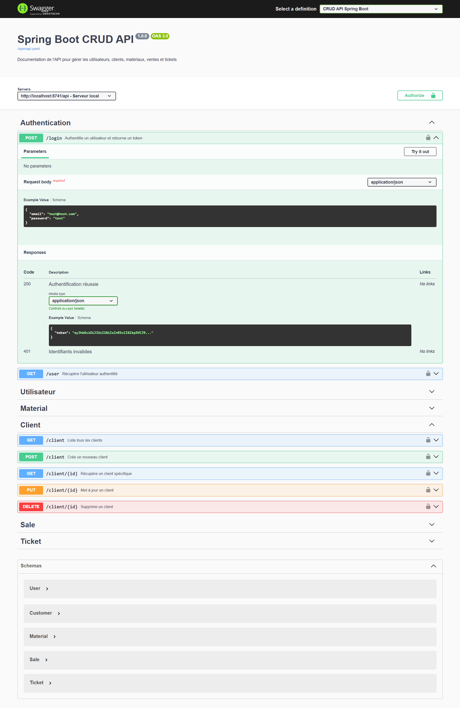

# CRUD Docker Spring boot Angular

Simple CRUD with API Spring boot 3.4.4, front-end Angular 19, MySQL and phpMyAdmin under Docker.

## Prerequisite
- Docker
- Docker Compose

## Install 

- Build of the project :
```bash  
git clone https://github.com/ghyslain12/spring-boot-docker-angular.git 
sudo chmod -R 777 spring-boot-docker-angular/
cd spring spring-boot-docker-angular
docker-compose up --build -d
```  


## Docker usage

- Mount container :
```bash  
docker-compose up
```  
- Unmount container :
```bash  
docker-compose down
```  

## Features
- Back-end: Spring boot Api JWT
- Front-end: Angular & JWT login / signup
- Testing
- Swagger
- Docker Mysql

## Services
- Angular (front-end): http://localhost:4200
- Spring boot (API): http://localhost:8741/api


## API [utilisateur, client, material, ticket, sale...]

Api NelmioApiDocBundle: http://localhost:8741/api/doc

### Create a user
  **`/utilisateur`** Add a new user in the system.

### List all users
  **`/utilisateur`** Get the list of all users.

### Get a user
  **`/utilisateur/{id}`** Get the detail of a user by his id.

### Update a user
  **`/utilisateur/{id}`** Update the informations of a existing user.

### Delete a user
  **`/utilisateur/{id}`** Delete a specific user by his id.


## JWT

### Get a token
  **`/login`** Authenticate a user and returns a token.

- Enable (application.properties): jwt.enable=true
- Disable (application.properties): jwt.enable=false

## Preview





